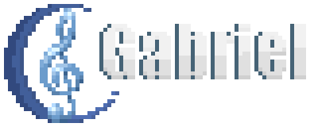

  

---

 Gabriel é um visualizador e editor de partituras em MusicXML totalmente gratuito, modificável e implementável, feito com amor e Graça divina!

## 📝Conteúdo

- [📝Conteúdo](#conteúdo)
- [🧐Sobre](#sobre)
- [🏁Como usar](#como-usar)
- [⛏️Feito usando](#️feito-usando)
- [✍️Autores](#️autores)

## 🧐Sobre

**Gabriel** é um visualizador e editor de partituras baseado em web utilizando somente **HTML5**, **JavaScript** e **CSS**. Este projeto visa abranger não somente pessoas que querem se aventurar na área de notação musical mas também proporcionar uma forma de visualizar partituras em MusicXML sem o auxílio de outros softwares, em sua grande maioria, pagos ou com "recursos demais", de forma interativa e amigável.

Não estou reinventando a roda, mas após anos utilizando o *Finale*, apanhando do *Encore*, passando raiva com *Sibelius* e tentando desmitificar o *MuseScore*, cansei de ver as diferenças gritantes entre cada um e resolvi fazer um próprio, que me atenda sem grandes firulas e seja direto ao ponto, além de ser totalmente implementável em um software à parte, sendo web ou não, com uma API própria.

E, sim, o nome do software é o meu sobrenome. É o nome de minha família, e é como as pessoas conhecem aquele que me instruiu no caminho da música desde criança: Gabriel, meu paizão. Uma singela homenagem. :)

## 🏁Como usar

O software está disponível online em sua versão estável em [gabriel.leandrogabriel.net](https://gabriel.leandrogabriel.net).

Contudo, caso necessite dele localmente por algum motivo, basta fazer download de todos os arquivos na pasta public, e o software deve funcionar sem problemas dentro de um servidor web básico local.

## ⛏️Feito usando

Um computador, um cérebro, temor a Deus e um sonho.

## ✍️Autores

- [@leo150250](https://github.com/leo150250) - Tudo (até agora rs)

Veja também a lista de [contribuidores](https://github.com/leo150250/gabriel/contributors) que participaram deste projeto.
